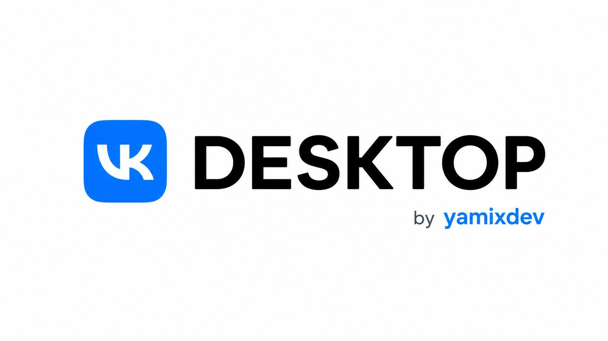

<div align="center">

# VK Desktop

[Русский](README.md) · [English](README.en.md)




An unofficial VK desktop client for Windows with VK Next, Discord Rich
Presence, and system tray integration.

</div>

## Features

- the full VK interface in a dedicated desktop application;
- a bundled VK Next artifact verified against pinned SHA-256 metadata;
- VK Next settings in a dedicated `1280×720` window;
- Discord Rich Presence for music without continuous status updates;
- media controls and quick navigation from the system tray;
- SPA transitions to Music, Messages, and Home without unnecessary reloads;
- notifications, unread badges, and minimize-to-tray behavior;
- built-in update checks and a Windows x64 installer;
- sandboxing, context isolation, validated IPC, and strict external-link policy.

## Installation

1. Open the [latest release](https://github.com/yamixdev/vk-desktop/releases/latest).
2. Download `VK-Desktop-Setup-<version>.exe`.
3. Run the installer and choose the installation directory.

> [!WARNING]
> Current builds may not have a paid Authenticode signature. Windows SmartScreen
> can therefore show an “Unknown publisher” warning. Download the application
> only from the official `yamixdev/vk-desktop` repository.

## VK Next

VK Next is enabled by default. It can be disabled through
`File → Settings → VK Next`; switching it requires reloading the VK page. Before
loading, the application checks the extension version, file list, and SHA-256
against pinned metadata. Open its settings through
`File → Settings → Open VK Next settings`.

VK Next is a third-party component. Its respective rights remain with its
owners; the VK Desktop proprietary license does not claim those rights.

## Memory and background operation

Chromium manages most memory automatically. VK Desktop additionally requests
garbage collection only for an oversized renderer and only after the window has
been hidden for at least five minutes. It checks once per minute and allows at
least 15 minutes between collections. Collection is skipped while music is
playing, the page is loading, or DevTools is attached.

The page is deliberately not discarded entirely because doing so would break
background music and notifications. A clean-profile idle measurement was about
407 MB of private working set; actual usage depends on the current page,
extensions, GPU, and session length.

## Building from source

Windows x64, Node.js 24, and npm 11 are required.

```powershell
git clone https://github.com/yamixdev/vk-desktop.git
cd vk-desktop
npm ci
npm start
```

Build the installer:

```powershell
npm run build
```

Useful commands:

| Command | Purpose |
| --- | --- |
| `npm run check` | Lint, quick unit tests, and VK Next integrity check |
| `npm run build:dir` | Unpacked Windows x64 build |
| `npm run build` | NSIS installer without publishing |
| `npm run publish` | Build and publish a release; signing is optional |

## Security

- remote content runs without Node.js integration;
- the renderer uses sandboxing and context isolation;
- IPC accepts schema-validated messages only from the main VK frame;
- external URLs open in the system browser without loading VK's redirector in
  the client;
- local service pages are served from a fixed `vk-desktop://local` allowlist;
- production builds validate ASAR integrity and disable dangerous Electron
  fuses.

## License and authorship

Copyright © 2026 **yamixdev**. This project is distributed under a
[proprietary source-available license](LICENSE) and is **not open source**.
Viewing the code, personal use of unmodified official binaries, and a private
local build for evaluation are allowed. Copying, modification, redistribution,
commercial use, and false authorship are prohibited without written permission.

A public repository can still be viewed and forked through GitHub's platform
features under its terms. That does not grant permission to present the project
as your own or distribute derivative versions.

## Suggestions, Pull Requests, and cooperation

Suggestions for improving the client are welcome through
[GitHub Issues](https://github.com/yamixdev/vk-desktop/issues) and
[Telegram](https://t.me/ilushadevz?direct).

You may clone or fork the repository, create a branch, and modify the code to
prepare a good-faith Pull Request for the official repository. This does not
permit publishing independent fork builds, distributing derivative versions,
or presenting them as official VK Desktop releases. See the
[contribution guide](CONTRIBUTING.en.md),
[Code of Conduct](CODE_OF_CONDUCT.en.md), and [license](LICENSE) for the complete
terms.

Companies, VK representatives, and potential partners can contact the author at
[Telegram: @ilushadevz](https://t.me/ilushadevz?direct). Requests concerning an
official partnership, rights transfer, or special permission must include
reasonable, verifiable proof of identity and authority, such as a message from
an official corporate domain or confirmation through another official channel.

## No affiliation

VK Desktop is an independent unofficial project. It is not affiliated with,
endorsed by, or supported by VK. All names and trademarks belong to their
respective owners.
